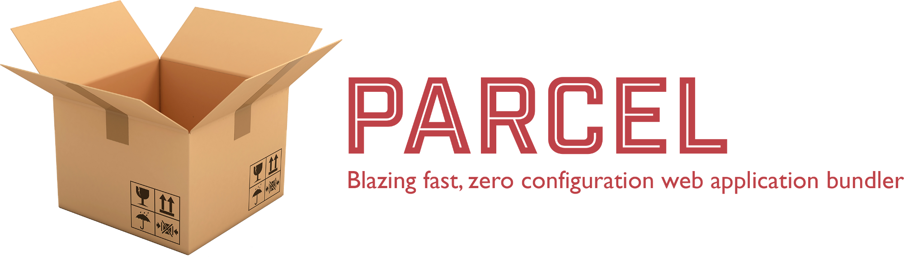
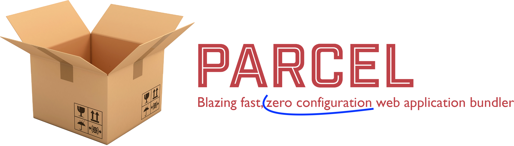

import { Head, Appear, Image, Notes } from 'mdx-deck'
import { Split, FullScreenCode } from 'mdx-deck/layouts'
import { CodeSurfer } from 'mdx-deck-code-surfer'
import { dark } from 'mdx-deck/themes'
import nightOwl from 'prism-react-renderer/themes/nightOwl'

export { components } from 'mdx-deck-code-surfer'
export const theme = {
  ...dark,
  codeSurfer: {
    ...nightOwl,
    showNumbers: false
  }
}

<Head>
  <title>A build history</title>
</Head>


# A build history

---

# About me

## no time for that.

---

In the beginning we had

#  and 

---

<CodeSurfer
  title="webpack devDependencies"
  code={require("!raw-loader!./snippets/webpack-dev-deps.mdx")}
  lang="json"
  showNumbers={false}
  steps={[
    {},
    { lines: [4, 9, 14, 16, 18, 19]}
  ]}
/>

---

and we were happy

# 😃

---

<Appear>
  <p>But then</p>
  <p>the second project starts</p>
  <p>and the third</p>
  <p>and the n-th</p>
  <h2>and we need to keep everything updated</h2>
</Appear>

---

<Image src="./images/updates.png" />

<Notes>
  or not...
</Notes>

---

export default Split


<Appear>
  <p>we ended up with a dependency madness</p>
  <p>plus the new version of `webpack`</p>
  <p>👈 incompatible with the old one</p>
  <p>multiplied by N projects</p>
</Appear>

---

# 😰

---

export default Split

# A new friend 😍


---

# but we use `sass`!?!

---

and CRA doesn't support `sass`...

(yet)

---

`npm run eject`

---

<CodeSurfer
  title="CRA eject"
  code={require("!raw-loader!./snippets/cra-eject-package.mdx")}
  lang="json"
  showNumbers={true}
  steps={[
    {},
    { range: [6, 53]}
  ]}
/>

---

and a brand new project using...

---


# Vue.js

---

with its own ~~`react-scripts`~~ `@vue/cli`!
##### (that now is customizable)

---

## Another new best friend


---

## That supports

#  and 

---

<CodeSurfer
  title="parcel package"
  code={require("!raw-loader!./snippets/parcel-package.mdx")}
  lang="json"
  showNumbers={true}
/>

---


---

## and then the company signed a contract with a new client!
# 🤑🤑🤑🤑

---

# who asked us to have everything deployed in a custom environment

---



---

# let's fix it!
### parcel plugins
#### almost no docs
## too hard

---

# Alternatives?

## `react-scripts-rewired`

<Appear>
  <p>customizable? ✅</p>
  <p>vue?</p>
</Appear>

---

# Alternatives?

## `neutrino`

<Appear>
  <p>customizable? ✅</p>
  <p>vue? ✅</p>
  <p>lint? ✅</p>
</Appear>

---

# Neutrino!


---

and everything was fine again
```json,
  "scripts": {
    "start": "neutrino start",
    "build": "neutrino build",
    "lint": "neutrino lint",
    "stylelint": "neutrino stylelint",
  },
  "devDependencies": {
    "@pager/neutrino-preset-pager-vue": "0.5.2",
    "neutrino": "8.3.0",
    "node-sass": "4.9.4",
    "sass-loader": "7.1.0"
  }
```

---

# Even better!

```js
// .eslintrc.js

const { Neutrino } = require('neutrino');

module.exports = Neutrino({ root: __dirname })
  .use('.neutrinorc.js')
  .call('eslintrc');
```

---

# ❤️

---

export default Split

## until this:
<Appear>
  
</Appear>

---

# 💔

---


---

NO!

---

> "Let's create our own build scripts!"

---

## That supports:

- react
- vue
- less
- sass
- all the good parts of a `react-scripts`
- our crazy deploy!

---

# Good news!

## Lots of good examples to ~~copy~~ get inspired

- https://github.com/facebook/create-react-app/tree/master/packages/react-scripts
- https://github.com/neutrinojs/neutrino
- https://github.com/kentcdodds/kcd-scripts
- https://github.com/vuejs/vue-cli/tree/dev/packages/%40vue/cli-service

---

<CodeSurfer
  title="package.json"
  code={require("!raw-loader!./snippets/bundler-package.mdx")}
  lang="json"
  showNumbers={false}
  steps={[
    {},
    {range: [2,4]},
    {range: [6,21]}
  ]}
/>

---

<CodeSurfer
  title="app package.json"
  code={require("!raw-loader!./snippets/app-package.mdx")}
  lang="json"
  showNumbers={false}
  steps={[
    {},
    {range: [2,5]}
  ]}
/>

---

<CodeSurfer
  title="bin js"
  code={require("!raw-loader!./bin/historic-scripts.js")}
  lang="javascript"
  showNumbers={false}
  steps={[
    {},
    {range: [8,21]},
    {range: [22,40]},
    {range: [24,32]},
    {range: [22,40]},
    {}
  ]}
/>

---

<CodeSurfer
  title="webpack.config.js"
  code={require("!raw-loader!./config/webpack.config.dev.js")}
  lang="javascript"
  showNumbers={false}
  steps={[
    {},
    {lines: [15]},
    {lines: [45]}
  ]}
/>

---

<CodeSurfer
  title="paths.js"
  code={require("!raw-loader!./config/paths.js")}
  lang="javascript"
  showNumbers={false}
  steps={[
    {},
    {range: [5,23]}
  ]}
/>

---

# Thank you!
